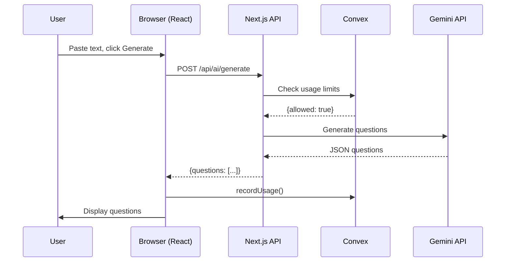

# Architecture

> System design, data flow, and key technical decisions
> **Last Updated**: 2026-02-04

---

## System Overview

QuizCreator is a modern web application built with the **Next.js App Router**, **Convex** for backend, and **Clerk** for authentication. The architecture prioritizes type safety, real-time updates, and developer experience.

### High-Level Architecture

```
┌─────────────────────────────────────────────────────────────────┐
│                         USER                                    │
│  (Browser / Mobile / Incognito)                                 │
└─────────────────────┬───────────────────────────────────────────┘
                      │
                      ▼
┌─────────────────────────────────────────────────────────────────┐
│                    NEXT.JS 16                                   │
│  ┌──────────────┐  ┌──────────────┐  ┌──────────────┐          │
│  │  App Router  │  │  API Routes  │  │   Middleware │          │
│  │  (SSR/SSG)   │  │  (/api/*)    │  │   (Auth)     │          │
│  └──────────────┘  └──────────────┘  └──────────────┘          │
│  ┌──────────────┐  ┌──────────────┐  ┌──────────────┐          │
│  │  Components  │  │    Hooks     │  │     Lib      │          │
│  │   (React)    │  │  (Custom)    │  │  (Utils)     │          │
│  └──────────────┘  └──────────────┘  └──────────────┘          │
└─────────────────────┬───────────────────────────────────────────┘
                      │
          ┌───────────┴───────────┐
          │                       │
          ▼                       ▼
┌─────────────────┐    ┌─────────────────┐
│     CONVEX      │    │  CLERK AUTH     │
│  (Database +    │    │  (User Identity)│
│   Serverless    │    │                 │
│   Functions)    │    │                 │
└────────┬────────┘    └─────────────────┘
         │
         ▼
┌─────────────────┐
│  EXTERNAL APIs  │
│  Google Gemini  │
│  (AI Generation)│
└─────────────────┘
```

---

## Request Lifecycle

### Example: User Creates Quiz from Text

```
1. USER ACTION
   User clicks "Generate Quiz" in browser
   
2. FRONTEND (Next.js)
   components/ai-text-generator.tsx
   → Validates input (50+ chars)
   → Shows loading state
   → Calls POST /api/ai/generate
   
3. API ROUTE (Next.js)
   app/api/ai/generate/route.ts
   → Validates auth (Clerk)
   → Validates text length
   → Checks usage limits (Convex)
   → Calls Gemini API
   
4. EXTERNAL API (Google)
   Gemini 1.5 Flash
   → Processes text
   → Generates questions
   → Returns JSON
   
5. API ROUTE (Continued)
   → Parses response
   → Validates question format
   → Returns questions to frontend
   
6. FRONTEND (Continued)
   → Records usage (Convex mutation)
   → Displays generated questions
   → User reviews and saves
   
7. DATABASE (Convex)
   convex/quizzes.ts
   → Inserts new quiz
   → Indexes by creator
   → Real-time update pushed to dashboard
```

### Data Flow Diagram



---

## Tech Stack Deep Dive

### 1. Next.js 16 (App Router)

**Why**: Modern React framework with App Router for better performance and DX

**Key Features Used**:
- App Router (file-based routing)
- Server Components (default)
- API Routes (serverless functions)
- Middleware (auth protection)
- Static Generation (landing page)

**Version**: 16.0.7

**Configuration**:
```javascript
// next.config.mjs
const nextConfig = {
  images: {
    domains: ['img.clerk.com'],
  },
}
```

### 2. Convex (Backend-as-a-Service)

**Why**: Type-safe, real-time database with serverless functions

**Key Features**:
- Real-time queries (auto-revalidate)
- Type generation from schema
- File-based serverless functions
- Automatic indexing

**Tables** (11 total):
```typescript
// Core tables
users, quizzes, organizations, orgMembers
subscriptions, invitations, join

// Feature tables  
examSessions, examAttempts, leaderboard
userMistakes, userProgress, aiUsage, presence
```

**Query Pattern**:
```typescript
// Frontend
const quizzes = useQuery(api.quizzes.getMyQuizzes)

// Backend (convex/quizzes.ts)
export const getMyQuizzes = query({
  handler: async (ctx) => {
    const identity = await ctx.auth.getUserIdentity()
    return ctx.db.query("quizzes")
      .withIndex("by_creator", q => q.eq("creatorId", identity.subject))
      .collect()
  }
})
```

### 3. Clerk (Authentication)

**Why**: Drop-in auth for React, handles sessions, webhooks, user management

**Features Used**:
- Email/password auth
- OAuth (Google, etc.)
- Session management
- User metadata
- Organization support (multi-tenant)

**Integration**:
```typescript
// Frontend
import { useUser } from '@clerk/nextjs'
const { user } = useUser()

// API Route
import { auth } from '@clerk/nextjs/server'
const { userId } = await auth()

// Middleware
import { clerkMiddleware } from '@clerk/nextjs/server'
export default clerkMiddleware()
```

### 4. Google Gemini API

**Why**: Cost-effective, large context window, good structured output

**Model**: Gemini 1.5 Flash (primary), Gemini 1.5 Pro (fallback)

**Use Cases**:
- Text-to-quiz generation
- PDF text extraction + question generation
- Question optimization (future)

**Configuration**:
```typescript
const SYSTEM_PROMPT = `You are a quiz question generator...`
const temperature = 0.3  // Low for consistent JSON
const maxOutputTokens = 4096
```

### 5. Tailwind CSS 4 + shadcn/ui

**Why**: Utility-first CSS, pre-built accessible components

**Key Files**:
- `app/globals.css` - Global styles, CSS variables
- `components/ui/` - 50+ shadcn components
- `tailwind.config.ts` - Theme configuration

**Design Tokens**:
```css
:root {
  --background: 0 0% 100%;
  --foreground: 0 0% 3.9%;
  --primary: 0 0% 9%;
  --primary-foreground: 0 0% 98%;
  /* ... */
}
```

---

## Folder Structure

```
QuizCreator/
│
├── app/                          # Next.js App Router
│   ├── (routes)/                 # Page components
│   │   ├── dashboard/
│   │   ├── invite/[token]/
│   │   ├── org/[slug]/
│   │   ├── sign-in/
│   │   └── sign-up/
│   │
│   ├── api/                      # API Routes
│   │   ├── ai/
│   │   │   ├── generate/         # POST: Text → Quiz
│   │   │   └── generate-pdf/     # POST: PDF → Quiz
│   │   ├── ip/                   # GET: Client IP
│   │   └── version/              # GET: App version
│   │
│   ├── globals.css               # Global styles
│   ├── layout.tsx                # Root layout
│   └── page.tsx                  # Landing page
│
├── components/                   # React Components
│   ├── ui/                       # shadcn/ui (50+ components)
│   ├── org/                      # Organization features
│   ├── quiz/                     # Quiz components
│   ├── ai-text-generator.tsx     # AI generation UI
│   ├── dashboard-client.tsx      # Main dashboard
│   ├── file-upload.tsx           # JSON upload
│   ├── landing-page.tsx          # Landing content
│   └── ... (90+ components)
│
├── convex/                       # Backend (Convex)
│   ├── schema.ts                 # Database schema
│   ├── quizzes.ts                # Quiz CRUD
│   ├── organizations.ts          # Org management
│   ├── orgMembers.ts             # Membership
│   ├── invitations.ts            # Invites
│   ├── join.ts                   # Join codes
│   ├── ai.ts                     # Usage tracking
│   ├── userProgress.ts           # Gamification
│   ├── mistakes.ts               # Wrong answers
│   ├── examSessions.ts           # Live sessions
│   └── ... (18 files)
│
├── lib/                          # Utilities
│   ├── ai-generator.ts           # Gemini integration
│   ├── pdf-extractor.ts          # PDF processing
│   ├── quiz.ts                   # Quiz types
│   ├── schema.ts                 # Zod validation
│   ├── translations.ts           # i18n
│   └── utils.ts                  # Helpers
│
├── docs/                         # Documentation
│   └── ... (this folder)
│
├── public/                       # Static assets
│   └── ... (icons, images)
│
├── styles/                       # Additional styles
│   ├── theme.css
│   └── globals.css
│
├── tests/                        # Test files
│   └── ... (unit tests)
│
├── .env.example                  # Environment template
├── .env.local                    # Local secrets
├── components.json               # shadcn config
├── convex.json                   # Convex config
├── next.config.mjs               # Next.js config
├── package.json                  # Dependencies
├── tailwind.config.ts            # Tailwind config
└── tsconfig.json                 # TypeScript config
```

---

## Key Architectural Decisions

### 1. No Separate Backend Server

**Decision**: Use Convex instead of Express/Fastify

**Rationale**:
- Type safety end-to-end
- Real-time subscriptions built-in
- No server management
- Automatic scaling

**Trade-off**: Vendor lock-in to Convex

### 2. App Router Over Pages Router

**Decision**: Use Next.js 14+ App Router

**Rationale**:
- Server Components by default (faster)
- Nested layouts
- Streaming support
- Better caching

**Trade-off**: Learning curve, some libraries not compatible

### 3. Client-Side State Management

**Decision**: Use React Context + Convex, no Redux/Zustand

**Rationale**:
- Convex handles server state
- React Context sufficient for UI state
- Simpler mental model

**Pattern**:
```typescript
// Global state via Convex
const quizzes = useQuery(api.quizzes.getMyQuizzes)

// UI state via React state
const [isOpen, setIsOpen] = useState(false)
```

### 4. File Upload Strategy

**Decision**: Direct to API route, not to Convex

**Rationale**:
- Convex has 1MB function payload limit
- API routes handle multipart/form-data better
- PDF processing is CPU-intensive (server-side)

**Flow**:
```
Client → API Route → Process PDF → Gemini → Store result in Convex
```

### 5. AI Error Handling

**Decision**: Retry 3x, then show user error. No human review queue.

**Rationale**:
- Fully automated
- Fast feedback to user
- User can try different input

**Fallback Chain**:
1. Gemini 1.5 Flash (cheap, fast)
2. Gemini 1.5 Pro (better quality)
3. User error message

---

## Security Model

### Authentication Flow

```
1. User signs in via Clerk
2. Clerk sets HTTP-only session cookie
3. Middleware validates session on every request
4. API routes check auth via Clerk
5. Convex functions verify identity
```

### Authorization Patterns

**Ownership Check**:
```typescript
// In Convex function
const identity = await ctx.auth.getUserIdentity()
if (!identity) throw new Error("Unauthorized")

const quiz = await ctx.db.get(args.id)
if (quiz.creatorId !== identity.subject) {
  throw new Error("Not authorized to access this quiz")
}
```

**Organization Check**:
```typescript
// Check if user is member of org
const membership = await ctx.db
  .query("orgMembers")
  .withIndex("by_org_user", q => 
    q.eq("orgId", orgId).eq("userId", identity.subject)
  )
  .first()

if (!membership) throw new Error("Not a member of this organization")
```

### Data Access Patterns

| Data | Who Can Access | How Enforced |
|------|----------------|--------------|
| User Profile | Owner only | Clerk auth |
| Private Quizzes | Creator only | creatorId check |
| Org Quizzes | Org members | orgId index + membership check |
| Shared Quiz Link | Anyone with link | No auth required (by design) |
| Exam Session | Session creator + participants | sessionId check |

---

## Performance Considerations

### Current Optimizations

1. **Static Generation**: Landing page is SSG
2. **Image Optimization**: Next.js Image component
3. **Code Splitting**: Automatic by Next.js
4. **Real-time**: Convex subscriptions (efficient polling)

### Known Bottlenecks

| Area | Issue | Mitigation |
|------|-------|------------|
| AI Generation | 2-5 second delay | Progress indicators, async processing |
| PDF Upload | Large files (10MB) | Chunking, streaming |
| Leaderboard | High read volume | Convex caching, pagination |

### Future Optimizations

- [ ] Edge functions for AI generation (lower latency)
- [ ] CDN for static assets
- [ ] Image optimization for avatars
- [ ] Query result caching

---

## Scalability

### Current Limits

| Resource | Limit | Notes |
|----------|-------|-------|
| PDF File Size | 10MB | API route limit |
| Text Input | 50,000 chars | Gemini context |
| AI Generations (Free) | 3/month | Soft limit |
| Questions per Quiz | Unlimited | DB constraint only |
| Concurrent Users | Unlimited | Vercel + Convex scale automatically |

### Scaling Strategy

**Database (Convex)**:
- Auto-scales with usage
- Add indexes for new query patterns
- Monitor query performance

**AI (Gemini)**:
- Rate limiting per user
- Queue for high volume (future)
- Fallback to cheaper model

**Frontend (Vercel)**:
- Edge network
- Automatic scaling
- Static generation where possible

---

## Monitoring & Debugging

### Logs

**Server Logs**:
- Vercel Function Logs (API routes)
- Convex Dashboard logs (database functions)
- Clerk Dashboard (auth events)

**Client Logs**:
- Browser console (React errors)
- Sentry (future) for error tracking

### Key Metrics to Track

| Metric | Tool | Alert Threshold |
|--------|------|-----------------|
| AI Generation Success Rate | Custom | < 95% |
| API Response Time | Vercel | > 5s |
| DB Query Time | Convex | > 1s |
| Auth Failures | Clerk | Spike detection |

---

## External Dependencies

### Required Services

| Service | Purpose | Cost | Fallback |
|---------|---------|------|----------|
| **Convex** | Database + Backend | Free tier → $25/mo | None (core) |
| **Clerk** | Authentication | Free tier → $25/mo | Custom auth (hard) |
| **Vercel** | Hosting | Free tier → $20/mo | Other hosting |
| **Google AI** | Quiz generation | $0.02 per 100 questions | OpenAI (expensive) |

### Optional Services

| Service | Purpose | When Needed |
|---------|---------|-------------|
| **Stripe** | Payments | Phase 5 |
| **PostHog** | Analytics | Growth phase |
| **Sentry** | Error tracking | Production |

---

*This architecture supports the current feature set and can scale to thousands of users with minimal changes.*
