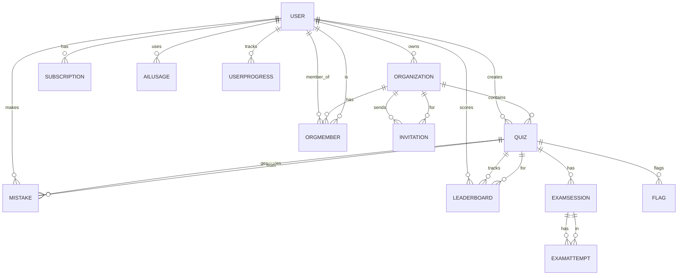

# Database Documentation

> Convex schema, relationships, indexes, and query patterns
> **Last Updated**: 2026-02-04

---

## Overview

QuizCreator uses **Convex** as its primary database and backend service. Convex provides:
- Type-safe database queries
- Real-time subscriptions (auto-revalidation)
- Serverless functions
- Automatic indexing

**Total Tables**: 11
**Primary Language**: TypeScript
**File Location**: `convex/schema.ts`

---

## Entity Relationship Diagram



---

## Complete Schema

### 1. Users Table

Stores user profiles synced from Clerk.

```typescript
users: defineTable({
  fullName: v.string(),
  email: v.string(),
  clerkId: v.string(),  // Clerk's unique ID
})
  .index("by_clerkId", ["clerkId"])
  .index("search_name", ["fullName"]),
```

**Fields**:
| Field | Type | Description |
|-------|------|-------------|
| `fullName` | `string` | User's display name |
| `email` | `string` | User's email address |
| `clerkId` | `string` | Unique ID from Clerk auth |

**Indexes**:
- `by_clerkId`: Lookup user by Clerk ID (used in auth)
- `search_name`: Full-text search on name (for autocomplete)

**Usage**:
```typescript
// Get current user
const user = await ctx.db
  .query("users")
  .withIndex("by_clerkId", q => q.eq("clerkId", identity.subject))
  .unique()
```

---

### 2. Quizzes Table

Core quiz storage with questions array.

```typescript
quizzes: defineTable({
  name: v.string(),
  creatorId: v.string(),      // Clerk ID (required)
  createdAt: v.number(),      // Timestamp (required)
  orgId: v.optional(v.id("organizations")),  // Optional org
  visibility: v.optional(v.string()),        // "private", "org", "public"
  questions: v.array(
    v.object({
      question: v.string(),
      answers: v.array(v.string()),
      correct_answer: v.string(),
      _originalIndex: v.optional(v.number()),
    })
  ),
})
  .index("by_creator", ["creatorId"])
  .index("by_name", ["name"])
  .index("by_orgId", ["orgId"]),
```

**Fields**:
| Field | Type | Description |
|-------|------|-------------|
| `name` | `string` | Quiz title |
| `creatorId` | `string` | Owner's Clerk ID |
| `createdAt` | `number` | Unix timestamp (ms) |
| `orgId` | `optional(Id)` | Organization ID (if org quiz) |
| `visibility` | `optional(string)` | "private", "org", or "public" |
| `questions` | `array` | Array of question objects |

**Question Schema**:
```typescript
{
  question: string,        // Question text
  answers: string[],       // Array of answer options
  correct_answer: string,  // Correct answer text
  _originalIndex?: number  // For ordering (optional)
}
```

**Indexes**:
- `by_creator`: List user's quizzes
- `by_name`: Search quizzes by name
- `by_orgId`: List org's quizzes

**Common Queries**:

```typescript
// Get user's quizzes
const myQuizzes = await ctx.db
  .query("quizzes")
  .withIndex("by_creator", q => q.eq("creatorId", userId))
  .collect()

// Get org quizzes
const orgQuizzes = await ctx.db
  .query("quizzes")
  .withIndex("by_orgId", q => q.eq("orgId", orgId))
  .collect()

// Search quizzes by name
const searchResults = await ctx.db
  .query("quizzes")
  .withIndex("by_name", q => q.gte("name", searchTerm))
  .take(10)
```

---

### 3. Organizations Table

Multi-user organization/team management.

```typescript
organizations: defineTable({
  name: v.string(),
  slug: v.string(),              // URL-friendly name
  createdAt: v.number(),         // Timestamp
  ownerId: v.string(),           // Admin's Clerk ID
  planId: v.string(),            // "school" or "free"
  settings: v.object({
    customLogo: v.optional(v.string()),
    customDomain: v.optional(v.string()),
  }),
  studentJoinCode: v.optional(v.string()),  // Auto-join code
})
  .index("by_slug", ["slug"])
  .index("by_owner", ["ownerId"])
  .index("by_code", ["studentJoinCode"]),
```

**Fields**:
| Field | Type | Description |
|-------|------|-------------|
| `name` | `string` | Organization name |
| `slug` | `string` | Unique URL identifier (e.g., "acme-high") |
| `createdAt` | `number` | Unix timestamp |
| `ownerId` | `string` | Creator's Clerk ID (admin) |
| `planId` | `string` | "school" for paid orgs |
| `settings` | `object` | Custom logo, domain |
| `studentJoinCode` | `optional(string)` | Code for students to join |

**Indexes**:
- `by_slug`: Lookup org by URL slug
- `by_owner`: List orgs owned by user
- `by_code`: Find org by join code

**Usage**:
```typescript
// Get org by slug (for public pages)
const org = await ctx.db
  .query("organizations")
  .withIndex("by_slug", q => q.eq("slug", "acme-high"))
  .unique()

// Join org with code
const org = await ctx.db
  .query("organizations")
  .withIndex("by_code", q => q.eq("studentJoinCode", "ABC123"))
  .unique()
```

---

### 4. OrgMembers Table

Membership and roles within organizations.

```typescript
orgMembers: defineTable({
  orgId: v.id("organizations"),
  userId: v.string(),         // Clerk ID
  role: v.string(),           // "admin" | "teacher" | "student"
  addedAt: v.number(),        // Timestamp
  addedBy: v.string(),        // Who invited them
})
  .index("by_org", ["orgId"])
  .index("by_user", ["userId"])
  .index("by_org_user", ["orgId", "userId"]),
```

**Fields**:
| Field | Type | Description |
|-------|------|-------------|
| `orgId` | `Id` | Organization ID |
| `userId` | `string` | Member's Clerk ID |
| `role` | `string` | "admin", "teacher", or "student" |
| `addedAt` | `number` | When they joined |
| `addedBy` | `string` | Clerk ID of inviter |

**Roles**:
- `admin`: Full control, can manage members, delete org
- `teacher`: Can create quizzes, view student results
- `student`: Can take quizzes, view own results

**Indexes**:
- `by_org`: List all members of org
- `by_user`: List all orgs user belongs to
- `by_org_user`: Check if user is member (unique lookup)

**Usage**:
```typescript
// Check user's role in org
const membership = await ctx.db
  .query("orgMembers")
  .withIndex("by_org_user", q => 
    q.eq("orgId", orgId).eq("userId", userId)
  )
  .unique()

if (membership?.role === "admin") {
  // Allow admin action
}

// List all org members
const members = await ctx.db
  .query("orgMembers")
  .withIndex("by_org", q => q.eq("orgId", orgId))
  .collect()
```

---

### 5. Invitations Table

Token-based invitations for teachers/admins.

```typescript
invitations: defineTable({
  email: v.string(),
  orgId: v.id("organizations"),
  role: v.string(),           // "admin" | "teacher"
  token: v.string(),          // Unique invitation token
  invitedBy: v.string(),      // Clerk ID of inviter
  status: v.string(),         // "pending" | "accepted" | "revoked"
})
  .index("by_token", ["token"])
  .index("by_email", ["email"])
  .index("by_org", ["orgId"]),
```

**Fields**:
| Field | Type | Description |
|-------|------|-------------|
| `email` | `string` | Invitee's email |
| `orgId` | `Id` | Organization ID |
| `role` | `string` | Role they'll have ("admin" or "teacher") |
| `token` | `string` | Unique URL token |
| `invitedBy` | `string` | Inviter's Clerk ID |
| `status` | `string` | Invitation state |

**Flow**:
1. Admin creates invitation (generates token)
2. Email sent with link: `/invite/{token}`
3. User clicks link, accepts invitation
4. Status changes to "accepted"
5. User added to orgMembers with specified role

**Usage**:
```typescript
// Validate invitation token
const invite = await ctx.db
  .query("invitations")
  .withIndex("by_token", q => q.eq("token", token))
  .unique()

if (invite?.status === "pending") {
  // Allow user to accept
}
```

---

### 6. Subscriptions Table

Payment/subscription tracking (Phase 5).

```typescript
subscriptions: defineTable({
  userId: v.string(),
  stripeSubscriptionId: v.string(),
  status: v.string(),        // "active", "canceled", "past_due"
  planId: v.string(),        // "pro", "elite", "school"
  endsAt: v.optional(v.number()),  // For canceled subs
})
  .index("by_user", ["userId"]),
```

**Fields**:
| Field | Type | Description |
|-------|------|-------------|
| `userId` | `string` | Subscriber's Clerk ID |
| `stripeSubscriptionId` | `string` | Stripe subscription ID |
| `status` | `string` | Subscription state |
| `planId` | `string` | Plan tier |
| `endsAt` | `optional(number)` | When access expires |

**Usage**:
```typescript
// Check if user has active subscription
const sub = await ctx.db
  .query("subscriptions")
  .withIndex("by_user", q => q.eq("userId", userId))
  .first()

const isPro = sub?.status === "active"
```

---

### 7. ExamSessions Table

Live quiz sessions with access codes.

```typescript
examSessions: defineTable({
  quizId: v.id("quizzes"),
  accessCode: v.string(),     // 6-digit PIN
  creatorId: v.string(),
  startTime: v.number(),
  endTime: v.optional(v.number()),
  status: v.string(),         // "LOBBY", "ACTIVE", "COMPLETED"
  settings: v.object({
    timer: v.optional(v.number()),       // Minutes
    shuffleQuestions: v.boolean(),
    showResults: v.boolean(),
  }),
})
  .index("by_accessCode", ["accessCode"])
  .index("by_creator", ["creatorId"])
  .index("by_status", ["status"]),
```

**Fields**:
| Field | Type | Description |
|-------|------|-------------|
| `quizId` | `Id` | Quiz being administered |
| `accessCode` | `string` | 6-digit code for students |
| `creatorId` | `string` | Teacher's Clerk ID |
| `startTime` | `number` | When session started |
| `endTime` | `optional(number)` | When session ended |
| `status` | `string` | Current state |
| `settings` | `object` | Quiz configuration |

**Status States**:
- `LOBBY`: Students joining, not started
- `ACTIVE`: Quiz in progress
- `COMPLETED`: Quiz finished

**Usage**:
```typescript
// Student joins with code
const session = await ctx.db
  .query("examSessions")
  .withIndex("by_accessCode", q => q.eq("accessCode", "123456"))
  .unique()

// List active sessions
const active = await ctx.db
  .query("examSessions")
  .withIndex("by_status", q => q.eq("status", "ACTIVE"))
  .collect()
```

---

### 8. ExamAttempts Table

Student submissions for exam sessions.

```typescript
examAttempts: defineTable({
  sessionId: v.id("examSessions"),
  studentId: v.string(),      // Clerk ID
  studentName: v.string(),
  answersDraft: v.any(),      // Map of question index to answer
  finalScore: v.optional(v.number()),
  submittedAt: v.optional(v.number()),
  lastHeartbeat: v.number(),  // For presence detection
})
  .index("by_session", ["sessionId"])
  .index("by_student", ["studentId"])
  .index("by_session_and_student", ["sessionId", "studentId"]),
```

**Fields**:
| Field | Type | Description |
|-------|------|-------------|
| `sessionId` | `Id` | Exam session ID |
| `studentId` | `string` | Student's Clerk ID |
| `studentName` | `string` | Display name |
| `answersDraft` | `any` | Current answers (auto-saved) |
| `finalScore` | `optional(number)` | Final score (null if not submitted) |
| `submittedAt` | `optional(number)` | Submission timestamp |
| `lastHeartbeat` | `number` | Last activity timestamp |

**Usage**:
```typescript
// Get all attempts for a session
const attempts = await ctx.db
  .query("examAttempts")
  .withIndex("by_session", q => q.eq("sessionId", sessionId))
  .collect()

// Get student's attempt
const attempt = await ctx.db
  .query("examAttempts")
  .withIndex("by_session_and_student", q => 
    q.eq("sessionId", sessionId).eq("studentId", studentId)
  )
  .unique()
```

---

### 9. Leaderboard Table

Quiz scores and rankings.

```typescript
leaderboard: defineTable({
  quizId: v.string(),
  name: v.string(),           // Display name
  avatarUrl: v.optional(v.string()),
  clerkId: v.optional(v.string()),  // Null for guests
  score: v.number(),
  duration: v.number(),       // Time in ms
  createdAt: v.optional(v.number()),
})
  .index("by_quizId", ["quizId"])
  .index("by_quiz_score", ["quizId", "score", "duration"])
  .index("by_score", ["score", "duration"]),
```

**Fields**:
| Field | Type | Description |
|-------|------|-------------|
| `quizId` | `string` | Quiz ID |
| `name` | `string` | Player name |
| `avatarUrl` | `optional(string)` | Profile image |
| `clerkId` | `optional(string)` | User ID (null = guest) |
| `score` | `number` | Score (percentage or points) |
| `duration` | `number` | Time taken (milliseconds) |
| `createdAt` | `optional(number)` | When score recorded |

**Indexes**:
- `by_quizId`: All scores for a quiz
- `by_quiz_score`: Sorted by score (for leaderboard)
- `by_score`: Global high scores

**Usage**:
```typescript
// Get leaderboard for quiz
const scores = await ctx.db
  .query("leaderboard")
  .withIndex("by_quiz_score", q => q.eq("quizId", quizId))
  .order("desc")
  .take(10)

// Get user's best score
const bestScore = await ctx.db
  .query("leaderboard")
  .withIndex("by_quizId", q => q.eq("quizId", quizId))
  .filter(q => q.eq(q.field("clerkId"), userId))
  .order("desc")
  .first()
```

---

### 10. UserMistakes Table

Tracks wrong answers for focused practice.

```typescript
userMistakes: defineTable({
  clerkId: v.string(),
  quizId: v.string(),
  questionId: v.string(),     // Unique question identifier
  question: v.string(),       // Question text
  answers: v.array(v.string()),
  correctAnswer: v.string(),
  createdAt: v.number(),
})
  .index("by_user", ["clerkId"])
  .index("by_user_quiz", ["clerkId", "quizId"])
  .index("by_user_question", ["clerkId", "questionId"]),
```

**Fields**:
| Field | Type | Description |
|-------|------|-------------|
| `clerkId` | `string` | User's Clerk ID |
| `quizId` | `string` | Source quiz |
| `questionId` | `string` | Unique question hash |
| `question` | `string` | Full question text |
| `answers` | `string[]` | All answer options |
| `correctAnswer` | `string` | Correct answer |
| `createdAt` | `number` | When mistake made |

**Usage**:
```typescript
// Get user's mistakes
const mistakes = await ctx.db
  .query("userMistakes")
  .withIndex("by_user", q => q.eq("clerkId", userId))
  .collect()

// Get mistakes for specific quiz
const quizMistakes = await ctx.db
  .query("userMistakes")
  .withIndex("by_user_quiz", q => 
    q.eq("clerkId", userId).eq("quizId", quizId)
  )
  .collect()
```

---

### 11. AIUsage Table

Tracks AI generation usage for billing.

```typescript
aiUsage: defineTable({
  userId: v.string(),
  month: v.string(),          // "2026-02"
  count: v.number(),          // Generations this month
})
  .index("by_user_month", ["userId", "month"]),
```

**Fields**:
| Field | Type | Description |
|-------|------|-------------|
| `userId` | `string` | User's Clerk ID |
| `month` | `string` | Month in "YYYY-MM" format |
| `count` | `number` | Number of generations |

**Usage**:
```typescript
// Check current usage
const usage = await ctx.db
  .query("aiUsage")
  .withIndex("by_user_month", q => 
    q.eq("userId", userId).eq("month", "2026-02")
  )
  .unique()

const remaining = 3 - (usage?.count ?? 0)
```

---

### 12. UserProgress Table (Gamification)

XP, levels, streaks, badges.

```typescript
userProgress: defineTable({
  clerkId: v.string(),
  xp: v.number(),
  level: v.number(),
  streak: v.number(),
  lastActiveDate: v.number(),
  badges: v.array(v.string()),
  quizzesCompleted: v.number(),
  perfectScores: v.number(),
  aiQuizzesGenerated: v.number(),
})
  .index("by_user", ["clerkId"])
  .index("by_xp", ["xp"]),
```

**Fields**:
| Field | Type | Description |
|-------|------|-------------|
| `clerkId` | `string` | User's Clerk ID |
| `xp` | `number` | Total experience points |
| `level` | `number` | Current level (1-10+) |
| `streak` | `number` | Consecutive days active |
| `lastActiveDate` | `number` | Timestamp of last activity |
| `badges` | `string[]` | Earned badge IDs |
| `quizzesCompleted` | `number` | Total quizzes finished |
| `perfectScores` | `number` | 100% scores achieved |
| `aiQuizzesGenerated` | `number` | AI generations used |

**Level Thresholds**:
```typescript
const LEVELS = [
  { level: 1, xp: 0 },
  { level: 2, xp: 100 },
  { level: 3, xp: 300 },
  { level: 4, xp: 600 },
  { level: 5, xp: 1000 },
  // ... continues
]
```

---

## Query Patterns

### Pattern 1: Ownership Check

Always verify user owns the resource:

```typescript
export const deleteQuiz = mutation({
  args: { id: v.id("quizzes") },
  handler: async (ctx, args) => {
    const identity = await ctx.auth.getUserIdentity()
    if (!identity) throw new Error("Unauthorized")
    
    const quiz = await ctx.db.get(args.id)
    if (!quiz) throw new Error("Quiz not found")
    
    // Ownership check
    if (quiz.creatorId !== identity.subject) {
      throw new Error("Not authorized to delete this quiz")
    }
    
    await ctx.db.delete(args.id)
  }
})
```

### Pattern 2: Organization-scoped Queries

Check membership before returning org data:

```typescript
export const getOrgQuizzes = query({
  args: { orgId: v.id("organizations") },
  handler: async (ctx, args) => {
    const identity = await ctx.auth.getUserIdentity()
    if (!identity) throw new Error("Unauthorized")
    
    // Check membership
    const membership = await ctx.db
      .query("orgMembers")
      .withIndex("by_org_user", q => 
        q.eq("orgId", args.orgId).eq("userId", identity.subject)
      )
      .unique()
    
    if (!membership) throw new Error("Not a member of this organization")
    
    return ctx.db
      .query("quizzes")
      .withIndex("by_orgId", q => q.eq("orgId", args.orgId))
      .collect()
  }
})
```

### Pattern 3: Pagination

For large lists, use pagination:

```typescript
export const getQuizzesPaginated = query({
  args: { 
    cursor: v.optional(v.string()),
    limit: v.number()
  },
  handler: async (ctx, args) => {
    const identity = await ctx.auth.getUserIdentity()
    
    let query = ctx.db
      .query("quizzes")
      .withIndex("by_creator", q => q.eq("creatorId", identity.subject))
    
    if (args.cursor) {
      query = query.startAfter(args.cursor)
    }
    
    const quizzes = await query.take(args.limit)
    const nextCursor = quizzes.length === args.limit 
      ? quizzes[quizzes.length - 1]._id 
      : null
    
    return { quizzes, nextCursor }
  }
})
```

### Pattern 4: Aggregations

Convex doesn't support GROUP BY, so aggregate client-side or use separate tables:

```typescript
// Get user's total mistakes count
const mistakes = await ctx.db
  .query("userMistakes")
  .withIndex("by_user", q => q.eq("clerkId", userId))
  .collect()

const count = mistakes.length  // Client-side count
```

---

## Indexing Best Practices

### ✅ Good Indexes

```typescript
// Composite index for common query
.index("by_org_user", ["orgId", "userId"])
// Query: Find membership for specific user in org

// Range index for sorting
.index("by_quiz_score", ["quizId", "score", "duration"])
// Query: Get high scores for quiz, sorted by score then time
```

### ❌ Bad Indexes

```typescript
// Too broad - returns too many results
.index("by_status", ["status"])
// Better: combine with creator or org

// Wrong order for range queries
.index("by_score_quiz", ["score", "quizId"])
// Should be: ["quizId", "score"] for equality then range
```

---

## Migrations

### Adding a New Field

1. Update schema with optional field:
```typescript
quizzes: defineTable({
  // ... existing fields
  newField: v.optional(v.string()),
})
```

2. Save file - Convex auto-deploys

3. Backfill existing data (if needed):
```typescript
// convex/migrations/backfillNewField.ts
export default internalMutation(async (ctx) => {
  const quizzes = await ctx.db.query("quizzes").collect()
  
  for (const quiz of quizzes) {
    if (!quiz.newField) {
      await ctx.db.patch(quiz._id, { newField: "default" })
    }
  }
})
```

4. Run migration:
```bash
npx convex run migrations/backfillNewField
```

---

*For more query examples, see individual feature docs in [08-FEATURES/](./08-FEATURES/).*
